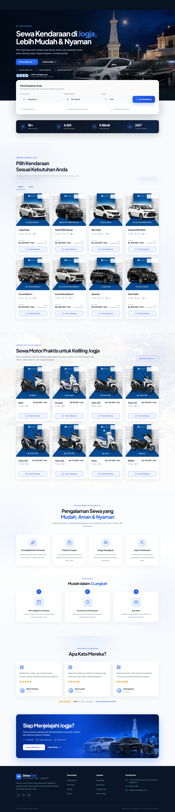

<div align="center">

# DriveMate

Your Trusted Travel Companion. Website katalog rental mobil dan motor di Bandung dengan pemesanan langsung melalui WhatsApp.


</div>



## Tentang proyek

DriveMate adalah landing page responsif untuk bisnis rental kendaraan. Pengunjung dapat melihat armada, membandingkan pilihan harga, membaca keunggulan layanan, dan membuka pesan WhatsApp yang sudah terisi sesuai kendaraan yang dipilih.

Tampilan mengangkat identitas visual modern mobility melalui kombinasi electric blue, deep charcoal, ruang putih yang lega, foto armada, landmark Bandung, dan elemen perjalanan. Implementasi dibangun menggunakan Next.js App Router dengan aset lokal agar cepat dan stabil.

## Fitur

- Header sticky dengan navigasi anchor dan menu mobile.
- Hero carousel dua slide dengan autoplay dan kontrol manual.
- Katalog delapan mobil dengan harga lepas kunci dan paket all-in.
- Katalog delapan motor dengan harga sewa harian.
- Pesan WhatsApp otomatis berdasarkan unit kendaraan.
- Section profil usaha, keunggulan layanan, CTA, dan informasi kontak.
- Floating WhatsApp button yang selalu mudah dijangkau.
- Layout responsif untuk desktop, tablet, dan mobile.
- Dukungan `prefers-reduced-motion` pada carousel.
- Aset gambar disimpan secara lokal dan ditampilkan melalui `next/image`.

## Tech stack

| Teknologi | Kegunaan |
| --- | --- |
| Next.js 16 | Framework, App Router, dan image optimization |
| React 19 | UI dan state interaktif |
| TypeScript | Type safety dengan mode strict |
| Tailwind CSS 4 | Styling dan responsive layout |
| Lucide React | Ikon antarmuka |

## Menjalankan secara lokal

### Prasyarat

- Node.js 24 atau lebih baru
- npm

### Instalasi

```bash
git clone https://github.com/hmad28/rentalmobil.git
cd rentalmobil
npm install
npm run dev
```

Buka [http://localhost:3000](http://localhost:3000) di browser.

## Perintah tersedia

```bash
npm run dev        # Menjalankan development server
npm run lint       # Menjalankan ESLint
npm run typecheck  # Memeriksa TypeScript
npm run build      # Membuat production build
npm run check      # Menjalankan lint, typecheck, dan build
npm run start      # Menjalankan hasil production build
```

## Struktur penting

```text
src/
├── app/
│   ├── globals.css       # Design tokens dan global styles
│   ├── layout.tsx        # Font, metadata, dan root layout
│   └── page.tsx          # Susunan landing page
├── components/sites/
│   └── sewamobiltugu-com-061d870e/root-8a5edab2/
│       ├── SiteHeader.tsx
│       ├── HeroSection.tsx
│       ├── CarFleetSection.tsx
│       ├── MotorFleetSection.tsx
│       ├── AboutSection.tsx
│       ├── BenefitsSection.tsx
│       ├── CtaSection.tsx
│       ├── SiteFooter.tsx
│       └── content.ts    # Data armada dan konfigurasi WhatsApp
└── types/
    └── sewamobil.ts

public/sites/             # Logo, foto kendaraan, dan aset visual
public/preview.png        # Pratinjau desktop untuk dokumentasi
```

## Mengganti informasi bisnis

Data kendaraan, harga, nomor WhatsApp, serta jalur aset utama berada di:

```text
src/components/sites/sewamobiltugu-com-061d870e/root-8a5edab2/content.ts
```

Informasi kontak dan tautan sosial berada di `SiteHeader.tsx` dan `SiteFooter.tsx`. Ganti logo serta gambar kendaraan di direktori berikut dengan aset milik bisnis:

```text
public/sites/sewamobiltugu-com-061d870e/root-8a5edab2/images/
```

Setelah melakukan perubahan, jalankan:

```bash
npm run check
```

## Deployment

Proyek dapat di-deploy ke platform yang mendukung Next.js. Untuk Vercel, import repository ini dan gunakan pengaturan build bawaan Next.js.

## Catatan aset dan identitas

Versi awal proyek menggunakan konten dan aset dari situs referensi untuk keperluan rekonstruksi tampilan. Sebelum digunakan secara publik untuk bisnis lain, ganti nama, logo, nomor kontak, copy, dan seluruh aset visual dengan materi yang dimiliki atau telah memperoleh izin penggunaan.

## Lisensi

Kode proyek mengikuti lisensi [MIT](LICENSE). Hak atas logo, foto, copy, dan aset merek tetap dimiliki oleh pemilik masing-masing.
